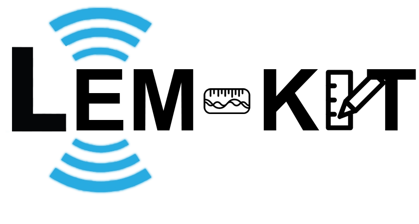
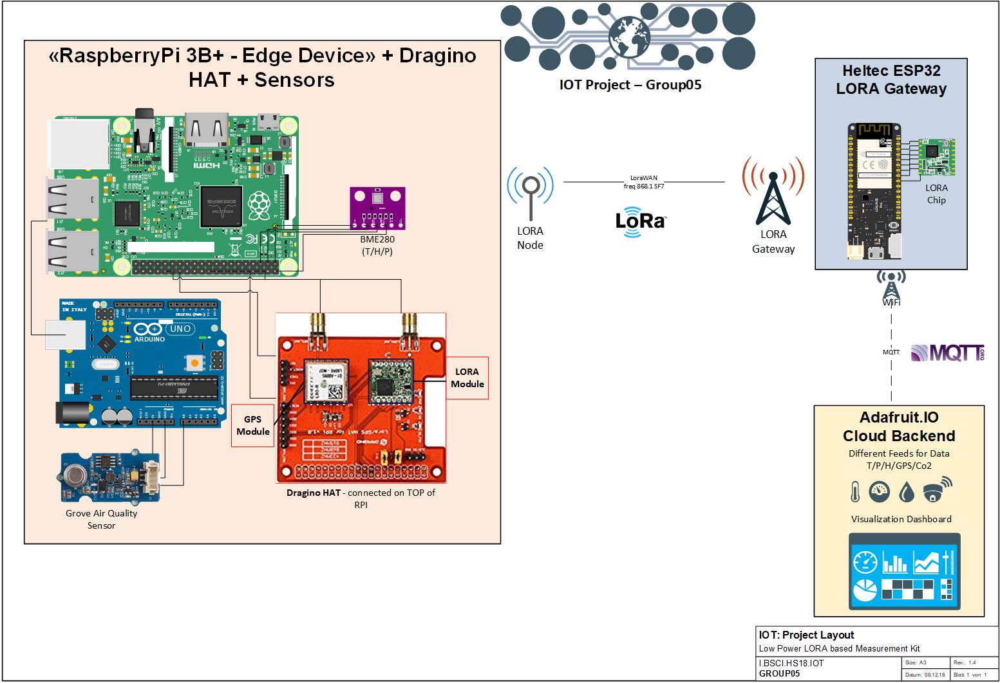
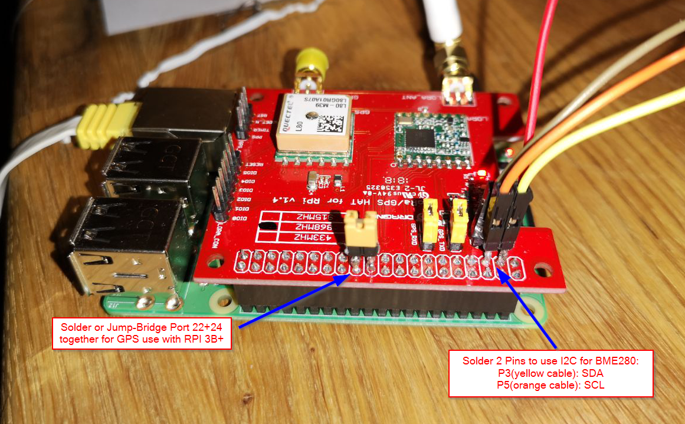
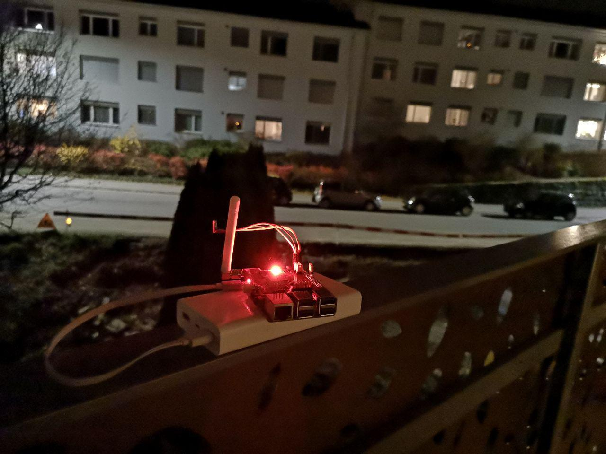
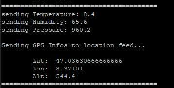
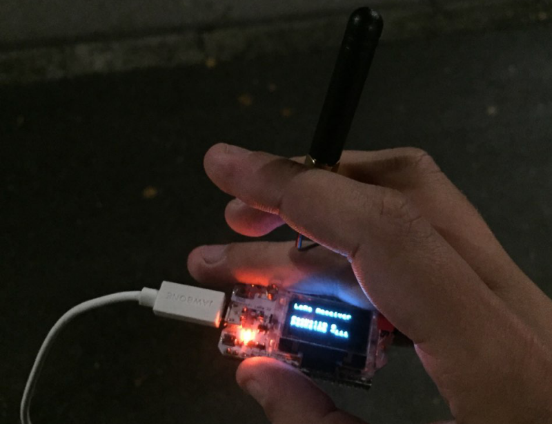
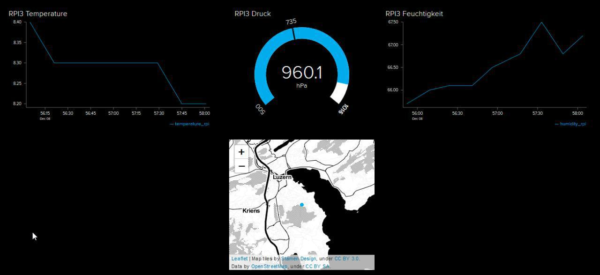

# IOT - Group05

 

This is the Repo from IOT HS18, Group 5, consisting of the members:

[@daveschafer](https://github.com/daveschafer)  
[@pascalinaebnit](https://github.com/pascalinaebnit)  
@tckueng  
@iaschran    

### Final Report - Project Documentation

**The Final Project Report lies here**: [Final-Report](/Final Project Submission/)  

**Final Report**: [Final-Report](/Final Project Submission/FinalReport-Group05.pdf)

This Repository describes the project our Group created in the module “Internet of Things” in the Fall Semester 2018. In this Project, our group of four students did implement an Environment Measurement Kit, which gathers Air Quality, Temperature, Humidity, Pressure and GPS Data from different Sensors. The Edge Device then sends these data via a Low Power Transmission Protocol (LoRa) to a Gateway. The Gateway redirects the data through WiFi to a Cloud Backend Service, which displays the data in the form of different Graphs and other measuring displays.

---

### Needed Hardware for this Project

- Raspberry Pi 3B+
- Dragino LORA/GPS Hat
- ESP32 Hellcat
- Arduino Uno (or an A2D Converter)
- Adafruit BME280 T/P/H Sensor
- Seeed Grove - Air Quality Sensor v1.3

## RPI

Code used on our Edge Device Raspberry Pi 3B+ to read out the sensors

[RPI-Folder](/RPI/)

Also, code used on the Arduino which is directly attached to the Raspberry lies here:

[Arduino-Folder](/Arduino/)

## ESP32

Code used on our Gateway (LORA) Device the ESP32.

[ESP32-Folder](/esp32/)

## Adafruit.IO

Code used to test and send data to the cloud Backend for Visualization:

[AdafruitIO-Folder](/Adafruit.IO/)

## Start The Application

Please carefully read all the documentation in this repository and its subfolders to understand the whole process.

To simple start the Raspberry **Node** application (without any changes) just do this:

    sudo -s
    git clone https://gitlab.enterpriselab.ch/IoT-I_BA_IOT/IoT-I_BA_IOT_H18/group05.git
    python3 group05/RPI/Master/Master.py

    #Or alternatively, if you want to run it in background
    apt-get install screen
    screen python3 group05/RPI/Master/Master.py &

To start the ESP32 **Gateway** Application, just flash the file

    \ESP32\LORA\ESP32_Gateway_Master\ESP32_Gateway_Master.ino

onto your Heltec ESP32.  

## Checkout LiveFeed

If you want to checkout the Live Feed of the currently running final project, just head over to:

https://io.adafruit.com/hslu_iot_hs18/dashboards/sample-dash-hs18

## General Project

We collect Data from different Sensors on an Edge/Node Device (Raspberry Pi3B+),  
transmit them via LORAWAN (freq 868.1) to our Gateway Device (Heltec ESP32)
standardize the Data and sent them to different Adafruit.IO Feeds.  
There we display them by different measuring displays ond a Dashboard.  

**Layout**

  

This project was a long ride of frustration and enthusiasm, which finally lead us to our desired solution:

**Impressions**

  
  
  

 