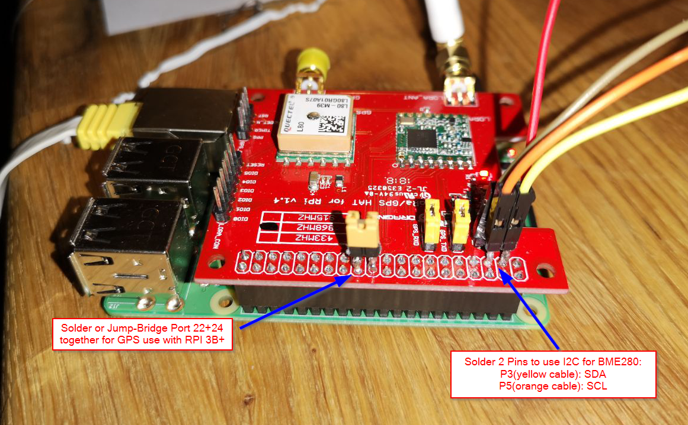
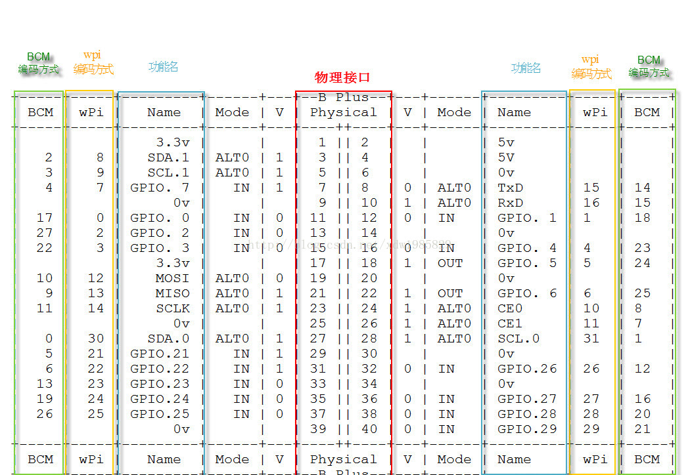

# Raspberry Pi Edge Device Setup

First of all, you'll need to get some Soldering done, if you work with the Dragino HAT: 



## BME280

Wiring:
```
    SDA: 3
    SCL: 5

    #note: for the Dragino you have to solder some pins onto the HAT
```

Prepartion:  
```
sudo apt-get install python3-pip
sudo pip3 install adafruit-circuitpython-bme280

configure I2C like described: https://github.com/fivdi/i2c-bus/blob/master/doc/raspberry-pi-i2c.md

Line 24, change the address if necessary:
bme280 = adafruit_bme280.Adafruit_BME280_I2C(i2c, address=0x76)
0x77 = original adafruit version
0x76 = aliexpress version (from us)

For the Dragino HAT you also have to solder pin 22 and 24 together (or jump bridge them)
```

## GPS
```
sudo pip3 install adafruit-circuitpython-gps
pip3 install pyserial
pip3 install serial

#on raspberrypi 3B+, for userspace:
python3 -m pip install pyserial
#and for sudo space
sudo python3 -m pip install pyserial
```

**Check if GPS Sensor is working**

    sudo cat /dev/ttyS0

There should be gibberish output containing the words "GPS" --> success

**Change Config Baudrate permanently to 9600**

    sudo nano /boot/config.txt
    change line: init_uart_baud=9600


_Source Informations for Sensors: https://learn.adafruit.com/adafruit-ultimate-gps/circuitpython-parsing_  
 

### GPS with Dragino HAT

Gettings GPS Data from the Dragino HAT is a bit different (becuase... reasons?).  

Anyway, just follow these instructions for Chapter "Enable UART": http://wiki.dragino.com/index.php?title=Getting_GPS_to_work_on_Raspberry_Pi_3_Model_B

After this, uncomment this line in the code gps_simpletest: "#uart = serial.Serial("/dev/ttyS0", baudrate=9600, timeout=3000)"

# LORA

Some small changes to the code 'Lora_sender.c' are necessary in order to get LORA working.

    uint32_t: base LORA frequency of your country (868.1Mhz for switzerland)  
    sf_t: Spreading Factor (default 7)
    syncword: must be the same on sender **and** receiver --> writeReg(REG_SYNC_WORD, 0x34);  

### Compiling & Running Lora

    Navigate to RPI_LORA_Sender Folder
    make
    sudo ./dragino_lora_app

### PINS and Schematic Informations

**PINS - Dragino Hat - WiringPi**

    // SX1272 - Raspberry connections
    NSS: 6 
    RST: 0
    DIO0: 7
    DIO1: 4
    DIO2: 5


_Wiring Information Source: https://wiki.dragino.com/index.php?title=Lora/GPS_HAT_


**PINS Dragino Hat - BCM Wiring**

    NSS: 25  
    RST: 17  
    DIO0: 4  
    DIO1: 23  
    DIO2: 24  


**Settings - GPS (Dragino HAT):**

- Databits: 8
- Parity: None
- Stopbit: one
- Baudrate: 9600

Wiring: you have to solder pin 22 and 24 together on the Dragino hat to get it working

_Wiring Information Source: From the GPS classes of https://github.com/emmellsoft/Dragino.Lora_

**Complete Wiring Schmeme**



More Wiring Information can be found here:  


### Footnote about the Dragino HAT

DONT USE A DRAGINO HAT


